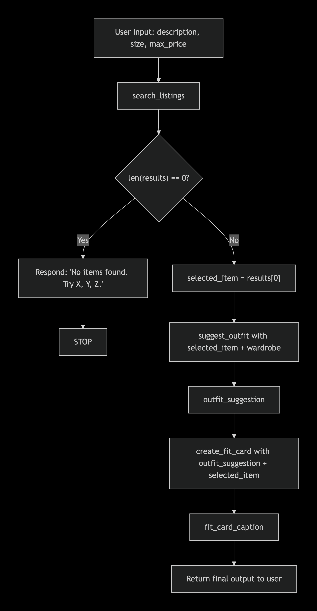

# FitFindr — planning.md

> Complete this document before writing any implementation code.
> Your spec and agent diagram are what you'll use to direct AI tools (Claude, Copilot, etc.) to generate your implementation — the more specific they are, the more useful the generated code will be.
> Your planning.md will be reviewed as part of your submission.
> Update it before starting any stretch features.

---

## Tools

List every tool your agent will use. For each tool, fill in all four fields.
You must have at least 3 tools. The three required tools are listed — add any additional tools below them.

### Tool 1: search_listings

**What it does:**
Finds available clothes that match the user’s size and budget. It filters available listings by category, style tags, size, price, and condition, then returns the best matches sorted by relevance.

**Input parameters:**
<!-- List each parameter, its type, and what it represents -->
- `description` (str): Free-text description of what the user wants — e.g., "vintage graphic tee"
- `size` (str): The user’s size — expects "S", "M", "L", "XL", etc.
- `max_price` (float): The user’s maximum budget in USD.

**What it returns:**
A list of dictionaries, each containing: id, title, description, category, style_tags, size, condition, price, colors, brand, platform. Returns an empty list [] if no matches found.

**What happens if it fails or returns nothing:**
Agent immediately responds: "No items found matching '[description]' in size [size] under $[max_price]. Try a different size, higher budget, or broader description." Then stops — no further tool calls.

---

### Tool 2: suggest_outfit

**What it does:**
Generates a styling suggestion by combining the chosen item with items in the user’s existing wardrobe (baggy jeans, chunky sneakers, etc.). Returns a short actionable tip.

**Input parameters:**
<!-- List each parameter, its type, and what it represents -->
- `new_item` (dict): A single listing dictionary from search_listings results
- `wardrobe` (dict): User’s wardrobe data, following wardrobe_schema.json — includes items with category, style_tags, fit, color, occasion.

**What it returns:**
A string of styling advice — e.g., “Pair this with your wide-leg jeans and platform Docs for a classic 90s grunge look. Roll the sleeves once and tuck the front corner slightly for shape.”

**What happens if it fails or returns nothing:**
If wardrobe is empty or contains no items that match the new item’s style, the agent returns a fallback suggestion similar to this: “Pair this tee with loose denim and chunky sneakers for an effortless look.” Still proceeds to create_fit_card.
---

### Tool 3: create_fit_card

**What it does:**
Formats the outfit suggestion into a casual “fit check” caption ready for social media sharing, including the purchase details.

**Input parameters:**
<!-- List each parameter, its type, and what it represents -->
- `outfit` (dict): The styling suggestion from suggest_outfit.
- `new_item`(dict): The selected listing (includes title, price, platform).

**What it returns:**
A string caption: e.g., “thrifted this faded band tee off depop for $22 and honestly it was made for my wide-legs 🖤 full look in my stories”

**What happens if it fails or returns nothing:**
If outfit or new_item is missing/incomplete, returns a generic caption: "new vintage find styled with my go-to pieces full look linked in bio"
---

### Additional Tools (if any)

<!-- Copy the block above for any tools beyond the required three -->

---

## Planning Loop

**How does your agent decide which tool to call next?**
The agent follows this strict conditional logic:

1. Parse user input — extract description, size, max_price, and wardrobe context (not a tool call, just reading)

2. Call search_listings(description, size, max_price)
- Use the exact description string from user input
- Pass extracted size (default to "M" if not specified)
- Pass extracted max_price (default to infinity if not specified)

3. Check search_listings results:

- If len(results) == 0:
     → Set error message: "No items found matching '[description]' in size [size] under $[max_price]. Try 'vintage band tee' instead of 'graphic tee', or increase budget to $40."
     → Return error message to user
     → STOP — do NOT call suggest_outfit or create_fit_card
- If len(results) > 0:
     → Set selected_item = results[0] (take top match)
     → Continue to step 4

4. Call suggest_outfit(selected_item, wardrobe)

- Pass the selected item dict
- Pass the user's wardrobe (from get_example_wardrobe() or session state)

5. Capture outfit_suggestion from suggest_outfit (will always return a string, even if fallback)

6. Call create_fit_card(outfit_suggestion, selected_item)
- Pass the outfit string and the selected item dict

7. Capture fit_card_caption from create_fit_card

8. Return final response to user combining:
     - The listing details (title, price, platform)
     - The outfit suggestion
     - The fit card caption
The agent knows it's done after returning the final response. No looping beyond these sequential calls.

---

## State Management

**How does information from one tool get passed to the next?**
<!-- Describe how your agent stores and accesses state within a session. What data is tracked? How is it passed between tool calls? -->
The agent stores within a single session (simple variables, not persistent):

Variable	           Source tool	            Type	           Used by
search_results	    search_listings	            list of dicts	 conditional check
selected_item	    assignment from results[0]  dict	           suggest_outfit, create_fit_card
outfit_suggestion  suggest_outfit	            str	           create_fit_card, final output
fit_card_caption   create_fit_card	            str	           final output

---

## Error Handling

For each tool, describe the specific failure mode you're handling and what the agent does in response.

| Tool | Failure mode | Agent response |
|---|---|---|
| search_listings | No results match the query | Sets `session["error"]` with a specific message naming the query and suggesting what to broaden; returns immediately — does NOT call suggest_outfit or create_fit_card |
| suggest_outfit | Wardrobe is empty | Calls LLM with a general styling prompt instead of a wardrobe-specific one; still returns a non-empty string and continues to create_fit_card |
| create_fit_card | Outfit input is empty or whitespace-only | Returns a descriptive error string without calling the LLM; does not raise an exception |

---

## Architecture

<!-- Draw a diagram of your agent showing how the components connect:
     User input → Planning Loop → Tools (search_listings, suggest_outfit, create_fit_card)
                                                                          ↕
                                                                   State / Session
     Show what triggers each tool, how state flows between them, and where error paths branch off.
     ASCII art, a Mermaid diagram (https://mermaid.js.org/syntax/flowchart.html), or an embedded
     sketch are all fine. You'll share this diagram with an AI tool when asking it to implement
     the planning loop and each individual tool. -->

---

## AI Tool Plan

<!-- For each part of the implementation below, describe:
     - Which AI tool you plan to use (Claude, Copilot, ChatGPT, etc.)
     - What you'll give it as input (which sections of this planning.md, your agent diagram)
     - What you expect it to produce
     - How you'll verify the output matches your spec before moving on

     "I'll use AI to help me code" is not a plan.
     "I'll give Claude my Tool 1 spec (inputs, return value, failure mode) and ask it to implement
     search_listings() using load_listings() from the data loader — then test it against 3 queries
     before trusting it" is a plan. -->

**Milestone 3 — Individual tool implementations:**

AI tool: Claude

Input to AI for search_listings:
"Implement search_listings(description, size, max_price) using load_listings() from utils/data_loader.py. Filter listings where size == size param, price <= max_price, AND description text matches title or style_tags or description field (case-insensitive partial match). Return all matches sorted by relevance (exact description matches first, then partial). Return empty list if none found."

Input to AI for suggest_outfit:
"Implement suggest_outfit(new_item, wardrobe) where new_item is a listing dict and wardrobe follows wardrobe_schema.json. Look for compatible bottoms (jeans, pants, shorts) and shoes in wardrobe. Return 1-3 outfit combos as a string. If wardrobe is empty or has no compatible items, return a generic fallback suggestion."

Input to AI for create_fit_card:
"Implement create_fit_card(outfit, new_item) that returns a unique Instagram-style caption each time. Use different templates, emojis, and phrasings based on new_item's price, platform, and style_tags. If inputs are incomplete, return a generic but still unique caption."

Verification: Test each with sample inputs and edge cases (empty wardrobe, no search results, different new_items).

**Milestone 4 — Planning loop and state management:**
AI tool: Claude
Input to AI: The planning loop section above + the architecture diagram
Ask: "Implement the main agent loop exactly as described — call search_listings first, check if results list is empty, only proceed to suggest_outfit and create_fit_card if non-empty. Store selected_item, outfit_suggestion, fit_card_caption in session variables. Return final output as a formatted string."
Verification: Run with the example query → get 3 results → proceed. Run with "purple polka dot tuxedo jacket, size XS, $10" → no results → stops.
---

## A Complete Interaction (Step by Step)

Write out what a full user interaction looks like from start to finish — tool call by tool call. Use a specific example query.

**Example user query:** "I'm looking for a vintage graphic tee under $30. I mostly wear baggy jeans and chunky sneakers. What's out there and how would I style it?"

**Step 1:**
<!-- What does the agent do first? Which tool is called? With what input? -->
Agent calls search_listings(description="vintage graphic tee", size="M", max_price=30.0)
Returns 3 listings:
[{"id": "t3", "title": "Faded Band Tee", "price": 22.0, "platform": "Depop", ...}, {...}, {...}]

**Step 2:**
<!-- What happens next? What was returned from step 1? What tool is called now? -->
Check results
len(results) = 3 which is > 0 → set selected_item = results[0] (Faded Band Tee)

**Step 3:**
<!-- Continue until the full interaction is complete -->
Agent calls suggest_outfit(new_item=selected_item, wardrobe=<user_wardrobe>)
Wardrobe contains: baggy jeans, chunky sneakers, black hoodie
Returns: "Outfit 1: Faded Band Tee + your baggy jeans + chunky sneakers. Roll the sleeves once. Outfit 2: Band tee under black hoodie + same jeans + sneakers."
Agent then calls create_fit_card(outfit="Outfit 1...", new_item=selected_item)
Returns: "thrifted this faded band tee off depop for $22 and honestly it was made for my wide-legs 🖤 full look in my stories"

**Final output to user:**
<!-- What does the user actually see at the end? -->
Found: Faded Band Tee — $22, Depop (Good condition)

💡 How to style it:
Outfit 1: Faded Band Tee + your baggy jeans + chunky sneakers. Roll the sleeves once.
Outfit 2: Band tee under black hoodie + same jeans + sneakers.

📸 Fit check caption:
"thrifted this faded band tee off depop for $22 and honestly it was made for my wide-legs 🖤 full look in my stories"
